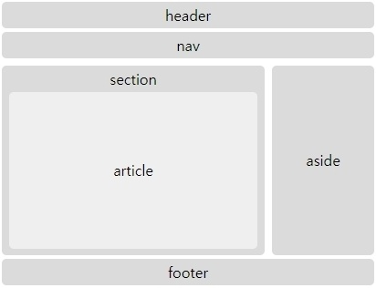

## HTML
`HTML Tag`

[`Semantic Tag`](https://www.w3schools.com/html/html5_semantic_elements.asp) : Semantic은 "의미의" 라는 뜻이다.
Semantic 태그는 개발자와 브라우저에게 의미가 있는 태그를 제공하게 된다.
즉, Semantic tag는 태그를 보고 내용의 의미를 어느정도 유추할 수 있다.
 
  - `header` : 헤더 부분. 사이트 소개, 로고, 메뉴, 머리글 등
  - `nav` : 네비게이터 부분, 사이트 내의 메뉴 등
  - `aside`  : 블로그 등에 있는 사이드 바와 같은 형태
  - `section` : 실제 문서 내용 등
  - `article` : 문서 내용이 많을 경우 하나의 section을 여러개의 article로 나눔 
  - `footer` : 푸터 부분, 사이트 제작자나 저작권 관련 정보 등

```
<!DOCTYPE html>
<html lang="ko">
<head>
    <title>haedal</title>
    <style type="text/css">
    body{width:440px;}
    header, nav, section, article, aside, footer{display:block; width:400px; margin:4px; padding:4px; background-color:#dbdbdb; text-align:center; border-radius: 5px}
    section{float:left; width:280px; height:200px;}
    article{width:264px; background-color:#efefef; height:164px; line-height: 164px; border-radius: 5px}
    aside{float:left; width:104px; height:200px; line-height: 200px}
    footer{overflow:hidden;}
    </style>
</head>
<body>
    <header>header</header>
    <nav>nav</nav>
    <section>
    section
        <article>article</article>
    </section>
<aside>aside</aside>
<footer>footer</footer>
</body>
</html>
```


`non-Semantic Tag`: Semantic Tag와는 다르게 의미를 가지지 않는 태그이다.
대신 사용자가 원하는 대로 정의 할 수 있다.

  - `div` : Division의 약자로 웹사이트의 레이아웃을 만들때 주로 사용한다.
```
<div class="header"></div>
<div class="footer"></div>
``` 


`heading` : 제목을 표시하는 태그. `<h1>`부터 `<h6>`까지 크기에 따라 사용할 수 있다.

```
<h1>This is heading 1</h1>
<h2>This is heading 2</h2>
<h3>This is heading 3</h3>
<h4>This is heading 4</h4>
<h5>This is heading 5</h5>
<h6>This is heading 6</h6>
```

<h1>This is heading 1</h1>
<h2>This is heading 2</h2>
<h3>This is heading 3</h3>
<h4>This is heading 4</h4>
<h5>This is heading 5</h5>
<h6>This is heading 6</h6>


<br>

`paragraph`
  - `br` : 줄바꿈 태그
  - `hr` : 수평선 ` <hr size="5" width="50px"> `
  - `p` : 문단을 나누는 태그
  ```
  <p>첫번째 문단<br>- 1번<br>- 2번<br>- 3번</p>
  <p>두번째 문단<br>- 하나<br>- 둘<br>- 셋</p>
  <hr size="5" width="50px"> 
  <p>세번째 문단<br>- A<br>- B<br>- C</p>
  ```
  <p>첫번째 문단<br>- 1번<br>- 2번<br>- 3번</p>
  <p>두번째 문단<br>- 하나<br>- 둘<br>- 셋</p>
  <hr size="5" width="50px"> 
  <p>세번째 문단<br>- A<br>- B<br>- C</p>


<br>
<br>

`font-style`
  - `b`, `strong` : 문자열을 굵게 강조하는 태그.
  
    <b>b 태그 적용</b>
  <br>
    <strong> strong 태그 적용 </strong>
    
    두 태그의 차이가 보이시나요? 사실상 눈에 보이는 차이는 없습니다.
    <br>`<strong>`태그는 문단 내에서 강조하고 싶은 문자열이 있을때 사용합니다. 검색엔진에서 좀 더 비중있게 처리하고, 음성 인식도구를 사용할때에도 강조해서 읽어줍니다.
    <br>`<b>`태그는 문자열만 굵게 표시하는 태그입니다.  
    
    
  
  - `i`, `em` : 문자열을 기울여서 강조하는 태그.
  
    <i>i 태그 적용</i>
    <br>
    <em>em 태그 적용</em>
    
    `<i>` 태그와 `<em>` 태그의 차이는 `<b>` 태그와 `<strong>` 태그의 차이와 같습니다.
    <br> i : 글씨만, em : 문자 강조
  - `del` : 취소선을 표시하는 태그.
   <br><del> del 태그 적용 </del>


`list`


  - `ol` + `li` : ordered list. 숫자나 알파벳 등 순서가 있는 목록
  <br>  `<li>` : list item
  <br>type 및 start 속성을 적용하여 모양 및 시작 번호를 설정 할 수 있다.
  
  ```
  <ol>
      <li> 1번 </li>
      <li> 2번 </li>
      <li> 3번 </li>
  </ol>
  ```
  <ol>
  <li> 1번 </li>
  <li> 2번 </li>
  <li> 3번 </li>
  </ol>
  
  ```
  <ol type = "I">
      <li> 1번 </li>
      <li> 2번 </li>
      <li> 3번 </li>
  </ol>
  ```
  <ol type = "I">
  <li> 1번 </li>
  <li> 2번 </li>
  <li> 3번 </li>
  </ol>
  
  ```
  <ol start="3">
      <li> 1번 </li>
      <li> 2번 </li>
      <li> 3번 </li>
  </ol>
  ```
  
  <ol start="3">
  <li> 1번 </li>
  <li> 2번 </li>
  <li> 3번 </li>
  </ol>
  
  - `ul` + `li` : unordered list. 순서가 필요없는 항목
  
  ```
  <ul>
      <li> 1번 </li>
      <li> 2번 </li>
      <li> 3번 </li>
  </ul>
  ```
  <ul>
  <li> 1번 </li>
  <li> 2번 </li>
  <li> 3번 </li>
  </ul>
  
`<a>`: 문서를 링크 시킬때 사용하는 태그


절대경로

```
<a href="http://www.naver.com">네이버 홈페이지</a>
```
<a href="http://www.naver.com">네이버 홈페이지</a>

상대경로 : 같은 프로젝트 폴더 내의 경로
<br>
```
<a href="python_function.md">python_function</a>
```
<a href="python_function.md" title="title 속성">파이썬_함수</a>


`id`, `mailto`, `_blank`
`media`
  - `img`
  - `iframe`


`form`
  - `input` : text, password, submit

추가적인 학습 : [MDN HTML Tag](https://developer.mozilla.org/en-US/docs/Web/HTML/Element), [poiemaweb](https://poiemaweb.com/), [velopert](https://velopert.com)


`fake_naver.html` : `form`태그와 `query`를 활용해 fake 네이버 검색창 만들기
```html
<!DOCTYPE html>
<html lang="en">
<head>
  <meta charset="UTF-8">
  <meta name="viewport" content="width=device-width, initial-scale=1.0">
  <meta http-equiv="X-UA-Compatible" content="ie=edge">
  <title>Document</title>
</head>
<body>
  <form action="https://search.naver.com/search.naver">
    <input type="text" name="query">
    <input type="submit">
  </form>
</body>
</html>
```